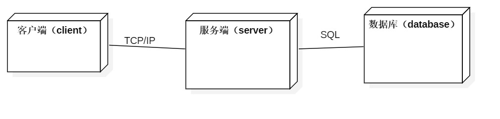
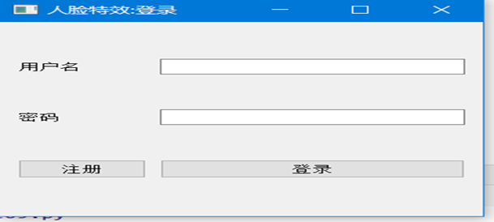
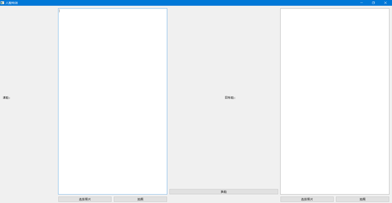
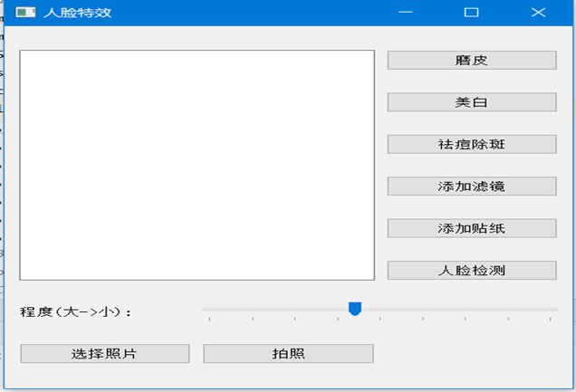
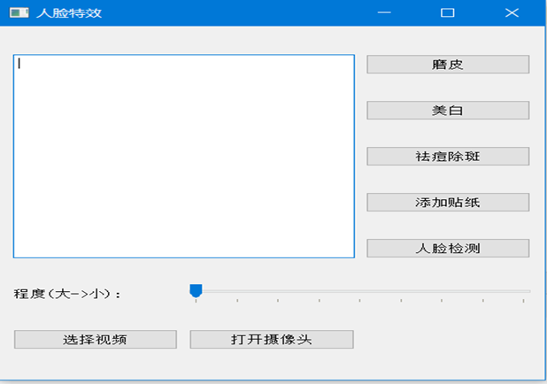

# 相机特效概要设计

## 一、引言

### 1.编写的目的

本阶段完成系统的大致设计并明确系统的数据结构与软件结构。本概要设计说明书的目的就是进一步细化软件设计阶段得出的软件概貌，把它加工成在程序细节上非常接近与源程序开发的软件表示。 根据需求分析说明书编写了本概要设计，以作为详细设计及系统实现的依据。本文主要阅读对象为相关技术人员和项目责任人。 

### 2.定义

### 参考资料

Python的开源人脸识别库：[https://cloud.tencent.com/developer/article/1348532]( https://cloud.tencent.com/developer/article/1348532 ) 

参考项目：[ https://github.com/seetaface/SeetaFaceEngine]( https://github.com/seetaface/SeetaFaceEngine 
 )

人脸关键点检测：[https://blog.csdn.net/qq_39438636/article/details/79304130](https://blog.csdn.net/qq_39438636/article/details/79304130)

基于深度学习的AI美颜:[https://www.imooc.com/article/34233](https://www.imooc.com/article/34233)

## 二、任务概述

### 1.系统功能

####  1.1概述

通过设计一款基于windows的exe应用程序，可以帮助用户，在PC端对自己的图片进行美化，滤镜，磨皮，添加贴纸等操作。同时也支持用户打开电脑的摄像头，从而进行实时处理。另外，我们还为照片添加了有趣的换脸功能，用户可以将一张照片上的人脸换为另外一张人脸，同时也支持在视频上进行换脸。本项目仅仅是为了练习和熟悉软件工程的一般过程，而建立的一个有趣的项目。本项目不为盈利，不会发布到市面上进行使用。

本产品适用于任何有对图片进行处理，美容，添加特效等需求的人。并且任何需要进行简单的换脸功用户都可以使用。总得来说，用户应该对美化图片或者操作图片具有较强的欲望。

#### 1.2主要功能

- 给图片或者视频中的人物进行磨皮，美白，祛痘除斑.用户可以选择磨皮的程度，美白的程度，祛痘除斑针对图片时，需要用鼠标点击斑点的位置，针对于视频时，仅仅进行粗略的祛斑。

- 检测图片或视频中的人脸，对人脸进行跟踪,返回其人脸框坐标及关键点坐标.该项功能为其他功能依赖，当然用户也可以点击仅开启检测人脸。

- 给图片添加相应的滤镜，如黑白，阳光，鲜艳等等。

- 将图片中的人脸更换为另一张照片中的人脸。用户需要传入两张照片，一张源图片，一张目的图片，并且用户要保证两张两张图片中都有且仅有一张人脸。

- 给视频中的人脸，添加相应的贴纸，如兔耳朵等。

- 对当前视频进行截图

- 一个简洁的GUI界面，供用户使用

### 2.运行时环境

本产产品是基于windows进行设计的，只能运行在windows端，是一个windows的桌面应用。只要用户拥有windows版的操作系统，就可以使用本应用。用户甚至不需要连接网络，便可以使用。

### 3.开发工具

PyCharm、 face++ 

### 4.条件与限制

 #### 本项目产品具有以下的约束

- 时间约束: 本产品需要于2019年11月26日之前，完成所有编码与测试。本项目需要于2019年12月10日之前，完成相关文档及内容的编写，并可进行展示。
- 预算约束: 本产品无预算消耗，故无预算约束。

+ 技术约束：本产品是要运行与windows端的桌面exe应用程序。并且是基于OpenCV4.0 + python 3.7 编写的，并且会用到相关的人脸识别和检测的相关类库。
+ 人员约束: 本项目仅有两位开发人员。两位开发人员拥有其他项目开发的经验，但是没有图像处理以及人脸识别的开发经验。
+ 组织约束: 本项目的开发要在指导老师李毅的指导下进行，相关功能可能会进行更改或者删除，添加。
+ 算法约束: 本项目实现的算法必然是基于网上的人脸检测开源库而实现的，算法精度和效果不能十分完美，会有瑕疵。
+ 人脸图片约束: 本项目的实现效果不会太完美。所以要求进行测试的人脸图片具有良好的光照以及清晰的效果，便于识别。另外，针对于换脸功能时，相应传入的两张照片中，各有且仅有一张人脸

## 三、总体设计

### 1.总体架构

#### CS架构

#### 系统总体架构图

设计简洁美观的UI界面，以便达到良好的用户体验；

使用数据存储用户数据，实现用户登录功能；

调用API实现处理效果。

### 2.系统主要功能和模块设计

#### 2.1算法流程

 参考资料：[https://cloud.tencent.com/developer/article/1348532]( https://cloud.tencent.com/developer/article/1348532 ) 

 参考项目：[ https://github.com/seetaface/SeetaFaceEngine]( https://github.com/seetaface/SeetaFaceEngine 
 )

#### 人脸识别

#### 2.2各模块功能描述

##### 图片处理

##### 视频处理

##### AI换脸

#### 2.3部署

## 四、数据设计

### 1. 数据结构

数据表：本应用并不含有较多的数据，仅使用一个表，也就是用户表。存储的字段（id，username，password）。系统通过该用户表来允许特定的用户进行使用。开放注册功能，但是需要填入相应的注册码。注册码是一串给定的密码，新用户的注册必须填入该注册码。

### 2. OO类的设计

用户实体类：User. 属性: id username  password 。行为: Login() Quit()  

### 3. 物理结构设计

- 用户登录信息; 用户名和密码

- 用户注册信息: 用户名和密码以及注册码

- 用户管理信息: 用户ID

### 4.数据结构与程序的关系

鉴于本程序是为了学习的目的而开发，不投入市场使用。所有本项目利用数据结构设计了相关的用户表，将程序开放给特定的用户使用，以防止各种用户使用本本项目进行一些不不道德的换脸行为。故数据结构中的用户表，决定了可以使用程序的人选，程序要使用，必须登录。

## 五、接口设计

### 1. 用户登录界面设计

 用户需在此界面填写相应的用户名和密码，才能够登录到本应用。当然也可以使用注册功能。但是注册需要填写一个给定的注册码，防止任何人都注册使用  

###  2.AI换脸界面设计

总体来说，AI换脸界面主要是有两个录入图片的区域。左边为源脸录入区域。右边为目标脸的录入区域。需要将源脸换到目标脸当中去。图片的录入允许使用选择本地图片，或者打开摄像头拍照的方式。

### 3. 图片美颜处理界面设计

以上是图片处理模块的用户界面。左侧是图片录入后的样子。右侧是功能，某些可以选用特定效果，某些需要指定程度的大小。当然录入图片也有两种方式。

### 4. 视频处理界面设计

视频处理界面与图像处理界面类似。

## 六、其他

### 1. 运行设计

####          6.1.1 运行模块设计  

- 图像处理模块: 用户选择相应的图片，或者打开摄像头拍摄一张图片，作为输入，再选择相应的功能即可。

- 视频处理模块：用户选择相应的视频，或者打开摄像头进行实时处理，再选择相应的功能即可。

- AI换脸模块: 用户选择两种图片作为输入，按照录入的位置不同，分别作为输入和输出图片，点击确定进行换脸。

####          6.1.2 运行控制  

- 在运行本系统时，就需要进行用户名以及密码的验证，系统核对后才能进行往下的操作，否则不能继续使用。  

### 2. 出错处理设计

#### 7.1 输出出错信息

通过在控制台打印出错信息，并且返回出错信息到服务器，进行出错检验。

#### 7.2 出错处理

- 重启服务器，并更新用户。

- 恢复及在启动技术: 在客户端直接重启应用。
-  禁用出错的功能，并向服务器发送相应的错误信息。

 ### 3.安全保密设计

- 本系统通过用户名及密码的方式来进行安全保密设计。

 ### 4.维护设计

在程序当中，设计一个检查模块以及更新模块。如果系统出错，可以通过检查模块检查是否由于缺少某些文件而引起的。如果是的话，则需要重新从服务器上下载应用程序。同时，对于一些软件的错误，可以通过在服务器端修改版本，提示用户更新，在升级维护。

 